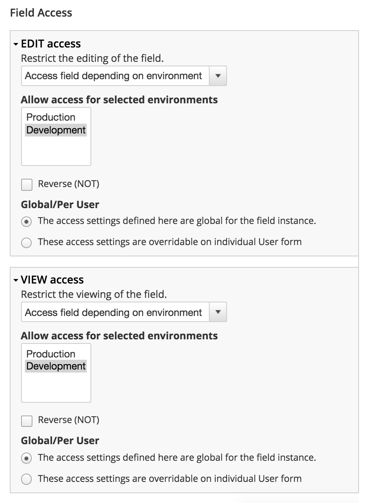

# Environment Field Access

Restrict an access to fields depending on environment.

## Usage

Create an environment via `hook_environment()`, go to editing of any existing
field and configure an access in `Field Access` settings group.



## Dependencies

- [Environment](https://www.drupal.org/project/environment)
- [Field Access](https://www.drupal.org/project/fieldaccess)

## Testing

```shell
drush dl simpletest
drush en simpletest -y
drush test-run EnvironmentFieldAccessTestCase
```
